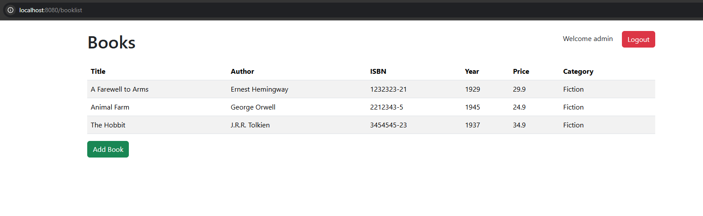
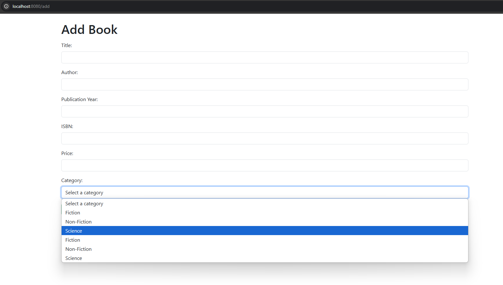

# Bookstore Application

A Spring Boot bookstore management application developed as part of backend programming studies at Haaga-Helia University of Applied Sciences.

## Features

- User authentication and role-based access control
- Book management (view, add, delete)
- Category management for books
- RESTful API endpoints
- Secure handling of user credentials

## Technologies

- Java (JDK 17)
- Spring Boot 3.3.5
- Spring Security
- Spring Data JPA
- Thymeleaf templates
- Bootstrap CSS
- MySQL database
- Maven for dependency management

## Screenshots

<!-- Add your screenshots here -->




## Setup Instructions

1. Clone the repository

   ```
   git clone https://github.com/your-username/bookstore.git
   ```

2. Configure MySQL database

   - Create a MySQL database named `test`
   - Update database credentials in `src/main/resources/application.properties` if needed

3. Build and run the application

   ```
   ./mvnw spring-boot:run
   ```

4. Access the application
   - Open your browser and navigate to: `http://localhost:8080`
   - Login with pre-configured credentials:
     - Regular user: `user/user`
     - Admin user: `admin/admin`

## API Endpoints

- `GET /api/books` - Get all books
- `GET /api/books/{id}` - Get book by ID

## Testing

Run tests using Maven:

```
./mvnw test
```

## Future Improvements

- Add book editing functionality
- Implement sorting and pagination for book list
- Add more detailed book information
- Enhance user management features

## License

This project is licensed under the [Apache License 2.0](LICENSE)
